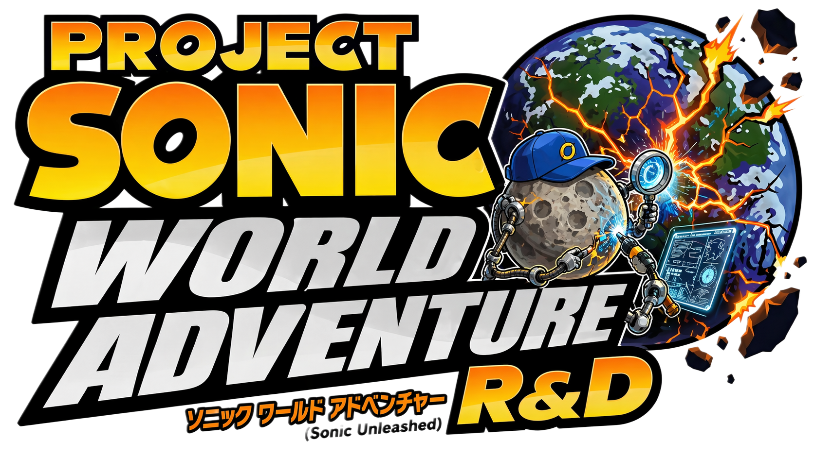
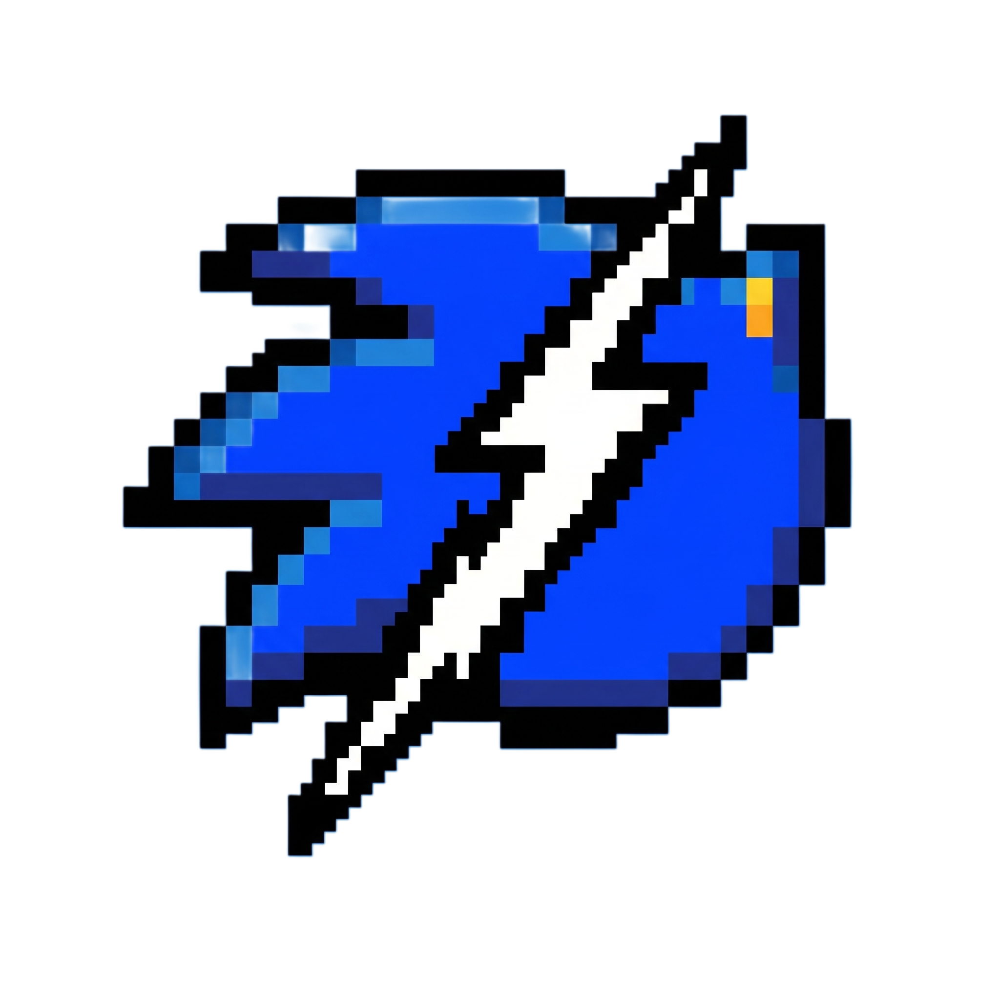

<p align="center">

</p>

# Project Sonic World Adventure R&D

Also referred to in this workspace as **SWARD**.

Research and Development workspace around Sonic Unleashed HD / Unleashed Recompiled, focused on UI/UX behavior, state machines, menu architecture, overlays, transitions, animation timing, and reusable design-engineering patterns.

> [!NOTE]
> This repository is the publishable R&D layer only. It contains open-source code already present in the workspace, research tooling, readable indexes, and transferable UI/UX notes.

> [!IMPORTANT]
> This repository does **not** publish extracted game assets, private game inputs, generated translated PowerPC C++, shader cache output, or leaked/proprietary source. Those remain local-only.

> [!WARNING]
> Sonic Unleashed and related assets belong to SEGA / Sonic Team. This repository is an unaffiliated research workspace and contribution layer. Use your own legally acquired files for any local asset-backed workflow.

> [!TIP]
> Project history now lives in [`CHANGELOG.md`](./CHANGELOG.md). The fastest way into the current R&D layer is the report stack under [`research_uiux/`](./research_uiux/).

> [!TIP]
> For the direct answer to "how much of the game is actually recovered here?", start with [`research_uiux/WHOLE_GAME_COVERAGE_AND_GAPS.md`](./research_uiux/WHOLE_GAME_COVERAGE_AND_GAPS.md).

> [!TIP]
> For the direct answer to "how close is the UI subset to a clean source-path-organized tree?", start with [`research_uiux/UI_SOURCE_PATH_RECOVERY_AND_HUMANIZATION_PLAN.md`](./research_uiux/UI_SOURCE_PATH_RECOVERY_AND_HUMANIZATION_PLAN.md).

> [!TIP]
> For the underlying scene/widget layer that now bridges `CSD/*`, `Menu/*`, and the local-only mirrored source tree, start with [`research_uiux/CSD_UI_FOUNDATION_HUMANIZATION.md`](./research_uiux/CSD_UI_FOUNDATION_HUMANIZATION.md).

> [!TIP]
> For the first beat that actually places those recovered families back into the local-only `SONIC UNLEASHED/` scaffold, start with [`research_uiux/LOCAL_SOURCE_FAMILY_PLACEMENT.md`](./research_uiux/LOCAL_SOURCE_FAMILY_PLACEMENT.md).

> [!TIP]
> For the tightened answer to "which hosts should the future UI debug executable actually sit on first?", start with [`research_uiux/FRONTEND_SHELL_AND_DEBUG_HOST_RECOVERY.md`](./research_uiux/FRONTEND_SHELL_AND_DEBUG_HOST_RECOVERY.md).

> [!TIP]
> For the newest widened seed beyond the `220`-path subset, start with [`research_uiux/BROADER_SOURCE_PATH_EXPANSION_PHASE47.md`](./research_uiux/BROADER_SOURCE_PATH_EXPANSION_PHASE47.md).

> [!TIP]
> For the newest workbench operator view, start with [`research_uiux/DEBUG_WORKBENCH_CATALOG_VIEW.md`](./research_uiux/DEBUG_WORKBENCH_CATALOG_VIEW.md).

> [!TIP]
> For the first proper non-CLI debug executable, start with [`research_uiux/NATIVE_GUI_DEBUG_WORKBENCH.md`](./research_uiux/NATIVE_GUI_DEBUG_WORKBENCH.md).

> [!TIP]
> For the first visual preview and local atlas binding layer in that executable, start with [`research_uiux/GUI_VISUAL_PREVIEW_AND_ATLAS_BINDING.md`](./research_uiux/GUI_VISUAL_PREVIEW_AND_ATLAS_BINDING.md).

> [!TIP]
> For the first Sonic/Werehog gameplay-HUD visual preview binding, including the exact proxy boundary, start with [`research_uiux/GAMEPLAY_HUD_PROXY_PREVIEW_BINDING.md`](./research_uiux/GAMEPLAY_HUD_PROXY_PREVIEW_BINDING.md).

> [!TIP]
> For the first timer-driven GUI playback controls in the native workbench, start with [`research_uiux/GUI_TIMELINE_PLAYBACK_CONTROLS.md`](./research_uiux/GUI_TIMELINE_PLAYBACK_CONTROLS.md).

> [!TIP]
> For the first state-aware preview motion adapter in the GUI workbench, start with [`research_uiux/GUI_STATE_AWARE_PREVIEW_MOTION.md`](./research_uiux/GUI_STATE_AWARE_PREVIEW_MOTION.md).

> [!TIP]
> For the first exact-family Title/Pause/Loading preview layouts in the GUI workbench, start with [`research_uiux/GUI_EXACT_FAMILY_PREVIEW_LAYOUTS.md`](./research_uiux/GUI_EXACT_FAMILY_PREVIEW_LAYOUTS.md).

> [!TIP]
> For the first decoded layout-evidence overlay inside the GUI visual preview, start with [`research_uiux/GUI_LAYOUT_EVIDENCE_PREVIEW_OVERLAY.md`](./research_uiux/GUI_LAYOUT_EVIDENCE_PREVIEW_OVERLAY.md).

> [!TIP]
> For the first frame-domain timeline readout inside that layout evidence overlay, start with [`research_uiux/GUI_LAYOUT_TIMELINE_FRAME_PREVIEW.md`](./research_uiux/GUI_LAYOUT_TIMELINE_FRAME_PREVIEW.md).

> [!TIP]
> For the first scene-graph primitive draw pass over the native GUI atlas preview, start with [`research_uiux/GUI_LAYOUT_SCENE_PRIMITIVE_PREVIEW.md`](./research_uiux/GUI_LAYOUT_SCENE_PRIMITIVE_PREVIEW.md).

> [!TIP]
> For the first gameplay HUD primitive preview over the Sonic/Werehog proxy atlas path, start with [`research_uiux/GUI_GAMEPLAY_HUD_PRIMITIVE_PREVIEW.md`](./research_uiux/GUI_GAMEPLAY_HUD_PRIMITIVE_PREVIEW.md).

> [!TIP]
> For the gameplay HUD primitive ownership audit against parsed `ui_prov_playscreen` scene facts, use [`research_uiux/GUI_GAMEPLAY_HUD_PRIMITIVE_OWNERSHIP_AUDIT.md`](./research_uiux/GUI_GAMEPLAY_HUD_PRIMITIVE_OWNERSHIP_AUDIT.md).

> [!TIP]
> For the first primitive animation-bank/frame-cursor cues in the native GUI, use [`research_uiux/GUI_LAYOUT_PRIMITIVE_PLAYBACK_CUES.md`](./research_uiux/GUI_LAYOUT_PRIMITIVE_PLAYBACK_CUES.md).

> [!TIP]
> For the readable GUI detail-pane parity view of those primitive cues, use [`research_uiux/GUI_LAYOUT_PRIMITIVE_DETAIL_CUES.md`](./research_uiux/GUI_LAYOUT_PRIMITIVE_DETAIL_CUES.md).

> [!TIP]
> For the first primitive channel-classification layer in the native GUI, use [`research_uiux/GUI_LAYOUT_PRIMITIVE_CHANNEL_CUES.md`](./research_uiux/GUI_LAYOUT_PRIMITIVE_CHANNEL_CUES.md).

> [!TIP]
> For the compact primitive channel-count legend in the native GUI preview, use [`research_uiux/GUI_LAYOUT_PRIMITIVE_CHANNEL_LEGEND.md`](./research_uiux/GUI_LAYOUT_PRIMITIVE_CHANNEL_LEGEND.md).

> [!TIP]
> For the current exact/proxy/layout/primitive readiness summary in the native GUI, use [`research_uiux/GUI_VISUAL_PARITY_SUMMARY.md`](./research_uiux/GUI_VISUAL_PARITY_SUMMARY.md).

> [!TIP]
> For the native GUI host-list readiness badges, use [`research_uiux/GUI_HOST_READINESS_BADGES.md`](./research_uiux/GUI_HOST_READINESS_BADGES.md).

> [!TIP]
> For the native GUI next-renderer blocker cues, use [`research_uiux/GUI_RENDERER_BLOCKER_CUES.md`](./research_uiux/GUI_RENDERER_BLOCKER_CUES.md).

> [!TIP]
> For the first exact-family primitive channel sample cues, use [`research_uiux/GUI_LAYOUT_CHANNEL_SAMPLE_CUES.md`](./research_uiux/GUI_LAYOUT_CHANNEL_SAMPLE_CUES.md).

> [!TIP]
> For the first exact-family primitive draw command descriptors, use [`research_uiux/GUI_LAYOUT_DRAW_COMMAND_DESCRIPTORS.md`](./research_uiux/GUI_LAYOUT_DRAW_COMMAND_DESCRIPTORS.md).

> [!TIP]
> For the first exact-family authored CSD cast transform descriptors, use [`research_uiux/GUI_AUTHORED_CAST_TRANSFORM_DESCRIPTORS.md`](./research_uiux/GUI_AUTHORED_CAST_TRANSFORM_DESCRIPTORS.md).

> [!TIP]
> For the first exact-family authored CSD keyframe curve descriptors, use [`research_uiux/GUI_AUTHORED_KEYFRAME_CURVE_DESCRIPTORS.md`](./research_uiux/GUI_AUTHORED_KEYFRAME_CURVE_DESCRIPTORS.md).

> [!TIP]
> For the first exact-family authored CSD keyframe sample descriptors, use [`research_uiux/GUI_AUTHORED_KEYFRAME_SAMPLE_DESCRIPTORS.md`](./research_uiux/GUI_AUTHORED_KEYFRAME_SAMPLE_DESCRIPTORS.md).

> [!TIP]
> For the first exact-family authored sampled transform descriptors, use [`research_uiux/GUI_AUTHORED_SAMPLED_TRANSFORM_DESCRIPTORS.md`](./research_uiux/GUI_AUTHORED_SAMPLED_TRANSFORM_DESCRIPTORS.md).

> [!TIP]
> For the first preview markers drawn from those authored sampled transforms, use [`research_uiux/GUI_AUTHORED_SAMPLED_TRANSFORM_PREVIEW.md`](./research_uiux/GUI_AUTHORED_SAMPLED_TRANSFORM_PREVIEW.md).

> [!TIP]
> For the first renderer-facing draw-command bridge from authored sampled transforms, use [`research_uiux/GUI_AUTHORED_SAMPLED_DRAW_COMMANDS.md`](./research_uiux/GUI_AUTHORED_SAMPLED_DRAW_COMMANDS.md).

> [!TIP]
> For the first sampled non-position channel state in that draw-command bridge, use [`research_uiux/GUI_AUTHORED_SAMPLED_CHANNEL_COMMANDS.md`](./research_uiux/GUI_AUTHORED_SAMPLED_CHANNEL_COMMANDS.md).

> [!TIP]
> For the first reusable sampled-channel evaluator carrying alpha, visibility, and cast-space deltas, use [`research_uiux/GUI_AUTHORED_SAMPLED_CHANNEL_EVALUATION.md`](./research_uiux/GUI_AUTHORED_SAMPLED_CHANNEL_EVALUATION.md).

> [!TIP]
> For the first actual asset-viewer mode in the native GUI, with unobstructed local atlas inspection, use [`research_uiux/GUI_ASSET_VIEWER_MODE.md`](./research_uiux/GUI_ASSET_VIEWER_MODE.md).

> [!TIP]
> For the first hardened asset-root discovery and atlas gallery navigation pass, use [`research_uiux/GUI_ASSET_GALLERY_ROOT_DISCOVERY.md`](./research_uiux/GUI_ASSET_GALLERY_ROOT_DISCOVERY.md).

> [!TIP]
> For the first Asset View CSD element-binding pass, use [`research_uiux/GUI_ASSET_CSD_ELEMENT_BINDINGS.md`](./research_uiux/GUI_ASSET_CSD_ELEMENT_BINDINGS.md).

> [!TIP]
> For the first Asset View CSD element navigation pass, use [`research_uiux/GUI_ASSET_CSD_ELEMENT_NAVIGATION.md`](./research_uiux/GUI_ASSET_CSD_ELEMENT_NAVIGATION.md).

> [!TIP]
> For the first selected-element crop/footprint preview in Asset View, use [`research_uiux/GUI_ASSET_CSD_CROP_PREVIEW.md`](./research_uiux/GUI_ASSET_CSD_CROP_PREVIEW.md).

> [!TIP]
> For the first Asset View CSD cast/subimage draw descriptors, use [`research_uiux/GUI_ASSET_CSD_SUBIMAGE_DRAW_DESCRIPTORS.md`](./research_uiux/GUI_ASSET_CSD_SUBIMAGE_DRAW_DESCRIPTORS.md).

> [!TIP]
> For the first Asset View CSD subimage source/destination draw commands, use [`research_uiux/GUI_ASSET_CSD_SUBIMAGE_DRAW_COMMANDS.md`](./research_uiux/GUI_ASSET_CSD_SUBIMAGE_DRAW_COMMANDS.md).

##  What This Repository Is

This project keeps a documented, versioned R&D environment for studying:

- title screens and intro flow
- pause, options, achievement, and message UI
- HUD activation and suppression behavior
- fades, black bars, static overlays, and transitions
- button guides and input lockouts
- timing/state relationships between readable patch code and local-only generated outputs
- reusable UI/UX engineering patterns for original projects

The codebase includes a snapshot of the open-source Unleashed Recompiled integration layer plus research automation that helps index readable UI code, patch hooks, and local research outputs.

##  What Lives Here

- Open-source handwritten runtime, UI, and patch code from the Unleashed Recompiled layer
- Build scripts, presets, and project metadata
- Local repository branding assets under [`docs/assets/branding/`](./docs/assets/branding)
- Research scripts under [`research_uiux/tools/`](./research_uiux/tools)
- Reusable template pack assets under [`research_uiux/templates/`](./research_uiux/templates)
- Reusable runtime reference code under [`research_uiux/runtime_reference/`](./research_uiux/runtime_reference)
- Portable runtime contracts under [`research_uiux/runtime_reference/contracts/`](./research_uiux/runtime_reference/contracts)
- A first contract-backed screen browser via [`research_uiux/STANDALONE_UI_DEBUG_SELECTOR.md`](./research_uiux/STANDALONE_UI_DEBUG_SELECTOR.md)
- A source-path-named launch layer for that browser via [`research_uiux/SOURCE_PATH_NAMED_DEBUG_SELECTOR.md`](./research_uiux/SOURCE_PATH_NAMED_DEBUG_SELECTOR.md)
- A broader UI-adjacent source-path seed via [`research_uiux/source_path_seeds/UI_ADJACENT_SOURCE_PATHS_FROM_MATCH_DUMP.txt`](./research_uiux/source_path_seeds/UI_ADJACENT_SOURCE_PATHS_FROM_MATCH_DUMP.txt)
- A Phase 47 widened source-path support layer via [`research_uiux/BROADER_SOURCE_PATH_EXPANSION_PHASE47.md`](./research_uiux/BROADER_SOURCE_PATH_EXPANSION_PHASE47.md)
- A compact debug workbench catalog view via [`research_uiux/DEBUG_WORKBENCH_CATALOG_VIEW.md`](./research_uiux/DEBUG_WORKBENCH_CATALOG_VIEW.md)
- A native windowed debug workbench via [`research_uiux/NATIVE_GUI_DEBUG_WORKBENCH.md`](./research_uiux/NATIVE_GUI_DEBUG_WORKBENCH.md)
- The first GUI visual preview and local atlas binding layer via [`research_uiux/GUI_VISUAL_PREVIEW_AND_ATLAS_BINDING.md`](./research_uiux/GUI_VISUAL_PREVIEW_AND_ATLAS_BINDING.md)
- A gameplay-HUD proxy preview binding report via [`research_uiux/GAMEPLAY_HUD_PROXY_PREVIEW_BINDING.md`](./research_uiux/GAMEPLAY_HUD_PROXY_PREVIEW_BINDING.md)
- Timer-driven GUI playback controls via [`research_uiux/GUI_TIMELINE_PLAYBACK_CONTROLS.md`](./research_uiux/GUI_TIMELINE_PLAYBACK_CONTROLS.md)
- State-aware GUI preview motion via [`research_uiux/GUI_STATE_AWARE_PREVIEW_MOTION.md`](./research_uiux/GUI_STATE_AWARE_PREVIEW_MOTION.md)
- Exact-family Title/Pause/Loading preview layouts via [`research_uiux/GUI_EXACT_FAMILY_PREVIEW_LAYOUTS.md`](./research_uiux/GUI_EXACT_FAMILY_PREVIEW_LAYOUTS.md)
- GUI layout-evidence preview overlays via [`research_uiux/GUI_LAYOUT_EVIDENCE_PREVIEW_OVERLAY.md`](./research_uiux/GUI_LAYOUT_EVIDENCE_PREVIEW_OVERLAY.md)
- GUI layout timeline frame previews via [`research_uiux/GUI_LAYOUT_TIMELINE_FRAME_PREVIEW.md`](./research_uiux/GUI_LAYOUT_TIMELINE_FRAME_PREVIEW.md)
- GUI layout scene primitive previews via [`research_uiux/GUI_LAYOUT_SCENE_PRIMITIVE_PREVIEW.md`](./research_uiux/GUI_LAYOUT_SCENE_PRIMITIVE_PREVIEW.md)
- GUI gameplay HUD primitive previews via [`research_uiux/GUI_GAMEPLAY_HUD_PRIMITIVE_PREVIEW.md`](./research_uiux/GUI_GAMEPLAY_HUD_PRIMITIVE_PREVIEW.md)
- GUI gameplay HUD primitive ownership audits via [`research_uiux/GUI_GAMEPLAY_HUD_PRIMITIVE_OWNERSHIP_AUDIT.md`](./research_uiux/GUI_GAMEPLAY_HUD_PRIMITIVE_OWNERSHIP_AUDIT.md)
- GUI layout primitive playback cues via [`research_uiux/GUI_LAYOUT_PRIMITIVE_PLAYBACK_CUES.md`](./research_uiux/GUI_LAYOUT_PRIMITIVE_PLAYBACK_CUES.md)
- GUI layout primitive detail cues via [`research_uiux/GUI_LAYOUT_PRIMITIVE_DETAIL_CUES.md`](./research_uiux/GUI_LAYOUT_PRIMITIVE_DETAIL_CUES.md)
- GUI layout primitive channel cues via [`research_uiux/GUI_LAYOUT_PRIMITIVE_CHANNEL_CUES.md`](./research_uiux/GUI_LAYOUT_PRIMITIVE_CHANNEL_CUES.md)
- GUI layout primitive channel legends via [`research_uiux/GUI_LAYOUT_PRIMITIVE_CHANNEL_LEGEND.md`](./research_uiux/GUI_LAYOUT_PRIMITIVE_CHANNEL_LEGEND.md)
- GUI visual parity summaries via [`research_uiux/GUI_VISUAL_PARITY_SUMMARY.md`](./research_uiux/GUI_VISUAL_PARITY_SUMMARY.md)
- GUI host readiness badges via [`research_uiux/GUI_HOST_READINESS_BADGES.md`](./research_uiux/GUI_HOST_READINESS_BADGES.md)
- GUI renderer blocker cues via [`research_uiux/GUI_RENDERER_BLOCKER_CUES.md`](./research_uiux/GUI_RENDERER_BLOCKER_CUES.md)
- GUI layout channel sample cues via [`research_uiux/GUI_LAYOUT_CHANNEL_SAMPLE_CUES.md`](./research_uiux/GUI_LAYOUT_CHANNEL_SAMPLE_CUES.md)
- GUI layout draw command descriptors via [`research_uiux/GUI_LAYOUT_DRAW_COMMAND_DESCRIPTORS.md`](./research_uiux/GUI_LAYOUT_DRAW_COMMAND_DESCRIPTORS.md)
- GUI authored cast transform descriptors via [`research_uiux/GUI_AUTHORED_CAST_TRANSFORM_DESCRIPTORS.md`](./research_uiux/GUI_AUTHORED_CAST_TRANSFORM_DESCRIPTORS.md)
- GUI authored keyframe curve descriptors via [`research_uiux/GUI_AUTHORED_KEYFRAME_CURVE_DESCRIPTORS.md`](./research_uiux/GUI_AUTHORED_KEYFRAME_CURVE_DESCRIPTORS.md)
- GUI authored keyframe sample descriptors via [`research_uiux/GUI_AUTHORED_KEYFRAME_SAMPLE_DESCRIPTORS.md`](./research_uiux/GUI_AUTHORED_KEYFRAME_SAMPLE_DESCRIPTORS.md)
- GUI authored sampled transform descriptors via [`research_uiux/GUI_AUTHORED_SAMPLED_TRANSFORM_DESCRIPTORS.md`](./research_uiux/GUI_AUTHORED_SAMPLED_TRANSFORM_DESCRIPTORS.md)
- GUI asset-viewer, atlas-gallery, and CSD element inspector reports via [`research_uiux/GUI_ASSET_VIEWER_MODE.md`](./research_uiux/GUI_ASSET_VIEWER_MODE.md), [`research_uiux/GUI_ASSET_GALLERY_ROOT_DISCOVERY.md`](./research_uiux/GUI_ASSET_GALLERY_ROOT_DISCOVERY.md), [`research_uiux/GUI_ASSET_CSD_ELEMENT_BINDINGS.md`](./research_uiux/GUI_ASSET_CSD_ELEMENT_BINDINGS.md), [`research_uiux/GUI_ASSET_CSD_ELEMENT_NAVIGATION.md`](./research_uiux/GUI_ASSET_CSD_ELEMENT_NAVIGATION.md), [`research_uiux/GUI_ASSET_CSD_CROP_PREVIEW.md`](./research_uiux/GUI_ASSET_CSD_CROP_PREVIEW.md), [`research_uiux/GUI_ASSET_CSD_SUBIMAGE_DRAW_DESCRIPTORS.md`](./research_uiux/GUI_ASSET_CSD_SUBIMAGE_DRAW_DESCRIPTORS.md), and [`research_uiux/GUI_ASSET_CSD_SUBIMAGE_DRAW_COMMANDS.md`](./research_uiux/GUI_ASSET_CSD_SUBIMAGE_DRAW_COMMANDS.md)
- A local-only support-substrate humanization pass via [`research_uiux/LOCAL_SUPPORT_SUBSTRATE_HUMANIZATION.md`](./research_uiux/LOCAL_SUPPORT_SUBSTRATE_HUMANIZATION.md)
- Runtime-backed support-substrate contracts via [`research_uiux/SUPPORT_SUBSTRATE_RUNTIME_CONTRACTS.md`](./research_uiux/SUPPORT_SUBSTRATE_RUNTIME_CONTRACTS.md)
- A source-tree mirror helper for the local-only `SONIC UNLEASHED/` scaffold via [`research_uiux/tools/materialize_source_tree.py`](./research_uiux/tools/materialize_source_tree.py)
- A local source-family note materializer for the `SONIC UNLEASHED/` scaffold via [`research_uiux/tools/materialize_source_family_notes.py`](./research_uiux/tools/materialize_source_family_notes.py)
- A tracked shell/debug host recovery layer via [`research_uiux/FRONTEND_SHELL_AND_DEBUG_HOST_RECOVERY.md`](./research_uiux/FRONTEND_SHELL_AND_DEBUG_HOST_RECOVERY.md)
- Publishable research notes such as:
- [`research_uiux/UI_CODE_INDEX.md`](./research_uiux/UI_CODE_INDEX.md)
- [`research_uiux/PATCH_HOOK_INDEX.md`](./research_uiux/PATCH_HOOK_INDEX.md)
- [`research_uiux/CODE_TO_LAYOUT_CORRELATION.md`](./research_uiux/CODE_TO_LAYOUT_CORRELATION.md)
- [`research_uiux/COMMON_FLOW_LOCALIZATION_EXTRACTION.md`](./research_uiux/COMMON_FLOW_LOCALIZATION_EXTRACTION.md)
- [`research_uiux/PPC_LAYOUT_STATE_LABELS.md`](./research_uiux/PPC_LAYOUT_STATE_LABELS.md)
- [`research_uiux/GAMEPLAY_HUD_CORE_RECOVERY.md`](./research_uiux/GAMEPLAY_HUD_CORE_RECOVERY.md)
- [`research_uiux/UI_SOURCE_PATH_RECOVERY_AND_HUMANIZATION_PLAN.md`](./research_uiux/UI_SOURCE_PATH_RECOVERY_AND_HUMANIZATION_PLAN.md)
- [`research_uiux/CSD_UI_FOUNDATION_HUMANIZATION.md`](./research_uiux/CSD_UI_FOUNDATION_HUMANIZATION.md)
- [`research_uiux/LOCAL_SOURCE_FAMILY_PLACEMENT.md`](./research_uiux/LOCAL_SOURCE_FAMILY_PLACEMENT.md)
- [`research_uiux/STANDALONE_UI_DEBUG_SELECTOR.md`](./research_uiux/STANDALONE_UI_DEBUG_SELECTOR.md)
- [`research_uiux/SOURCE_PATH_NAMED_DEBUG_SELECTOR.md`](./research_uiux/SOURCE_PATH_NAMED_DEBUG_SELECTOR.md)
- [`research_uiux/PAUSE_STATUS_WORLDMAP_DEEP_DIVE.md`](./research_uiux/PAUSE_STATUS_WORLDMAP_DEEP_DIVE.md)
- [`research_uiux/BOSS_RESULT_SAVE_LOAD_DEEP_DIVE.md`](./research_uiux/BOSS_RESULT_SAVE_LOAD_DEEP_DIVE.md)
- [`research_uiux/BOSS_RESULT_SAVE_VISUAL_TAXONOMY.md`](./research_uiux/BOSS_RESULT_SAVE_VISUAL_TAXONOMY.md)
- [`research_uiux/VISUAL_ATLAS_DOCS.md`](./research_uiux/VISUAL_ATLAS_DOCS.md)
- [`research_uiux/SUBTITLE_CUTSCENE_PRESENTATION_DEEP_DIVE.md`](./research_uiux/SUBTITLE_CUTSCENE_PRESENTATION_DEEP_DIVE.md)
- [`research_uiux/CODE_BACKED_RUNTIME_IMPLEMENTATION.md`](./research_uiux/CODE_BACKED_RUNTIME_IMPLEMENTATION.md)
- [`research_uiux/REUSABLE_PORT_KITS.md`](./research_uiux/REUSABLE_PORT_KITS.md)
- [`research_uiux/DATA_DRIVEN_RUNTIME_CONTRACTS.md`](./research_uiux/DATA_DRIVEN_RUNTIME_CONTRACTS.md)
- [`research_uiux/TEMPLATE_PACK_FOR_ORIGINAL_PROJECTS.md`](./research_uiux/TEMPLATE_PACK_FOR_ORIGINAL_PROJECTS.md)
- [`research_uiux/UI_UX_INSPIRATION_NOTES.md`](./research_uiux/UI_UX_INSPIRATION_NOTES.md)
- [`research_uiux/WHOLE_GAME_COVERAGE_AND_GAPS.md`](./research_uiux/WHOLE_GAME_COVERAGE_AND_GAPS.md)
- [`research_uiux/FULL_UI_ARCHAEOLOGY_CROSS_REFERENCE.md`](./research_uiux/FULL_UI_ARCHAEOLOGY_CROSS_REFERENCE.md)
- [`CHANGELOG.md`](./CHANGELOG.md) for the repo timeline from initial publication to the latest research beat
- Repo policy under [`REPO_PUBLISHING_SCOPE.md`](./REPO_PUBLISHING_SCOPE.md)

##  What Stays Local

- `UnleashedRecompLib/private/`
- `UnleashedRecompLib/ppc/`
- `UnleashedRecompLib/shader/shader_cache.*`
- `extracted_assets/`
- `external_tools/`
- `local_build_env/`
- `SONIC UNLEASHED/`
- `SONIC UNLEASHED/**/*.sward.md`
- `Match SU OG source code folders and locations.txt`
- `Research SU.txt`
- machine-specific build trees and caches
- research reports or JSON catalogs that directly enumerate proprietary extracted content or generated translated code

> [!TIP]
> The ignore boundary for those local-only materials is enforced in [`.gitignore`](./.gitignore). If you expand the local research workspace, keep that boundary intact.

##  Relationship to Upstream

This repository builds on the open-source work of:

- [UnleashedRecomp](https://github.com/hedge-dev/UnleashedRecomp)
- [XenonRecomp](https://github.com/hedge-dev/XenonRecomp)
- [XenosRecomp](https://github.com/hedge-dev/XenosRecomp)

The goal here is different from the upstream end-user distribution goal. This repo is structured as an R&D sandbox for:

- UI/UX reverse-engineering notes
- local-only asset-backed archaeology
- publishable tooling and documentation
- transferable templates and architecture patterns

> [!TIP]
> The codebase itself consistently uses the `SWA` shorthand, which aligns with `Sonic World Adventure`. For the repository-facing identity, this workspace uses the shorter **SWARD** label.

##  Repository Layout

```text
.
|-- UnleashedRecomp/                 # open-source runtime, UI, and patch layer
|-- UnleashedRecompLib/              # config plus local-only private/generated dirs
|-- docs/                            # build and local acquisition guidance
|-- research_uiux/
|   |-- tools/                       # research automation scripts
|   |-- UI_CODE_INDEX.md
|   |-- PATCH_HOOK_INDEX.md
|   `-- UI_UX_INSPIRATION_NOTES.md
|-- REPO_PUBLISHING_SCOPE.md
`-- .github/workflows/               # repo validation workflows
```

##  Local Workflow

1. Clone the repository with submodules.
2. Keep private game inputs local under `UnleashedRecompLib/private/`.
3. Generate translated code and extracted assets locally only when needed.
4. Commit publishable tooling, notes, and safe code changes.
5. Keep extracted proprietary content and generated translation outputs out of git history.

Supporting docs:

- [`docs/BUILDING.md`](./docs/BUILDING.md)
- [`docs/DUMPING-en.md`](./docs/DUMPING-en.md)
- [`CHANGELOG.md`](./CHANGELOG.md)
- [`REPO_PUBLISHING_SCOPE.md`](./REPO_PUBLISHING_SCOPE.md)

##  CI Modes

> [!NOTE]
> This repository supports two validation modes.
>
> - If private asset secrets are configured, GitHub Actions can run full asset-backed build validation.
> - If private asset secrets are not configured, CI falls back to publishable-scope validation for docs, boundaries, research tooling, and preset integrity.

That split is intentional. Public-safe automation should pass without requiring proprietary inputs, while full runtime builds remain possible in controlled environments.

##  Contributing

Contributions are welcome for:

- research tooling
- documentation quality
- UI code and patch indexing
- CI/workflow hardening
- generic state-machine and UI/UX pattern extraction
- improvements to the open-source integration layer already present here

Do not contribute:

- extracted game assets
- private Xbox 360 content
- generated translated PPC output
- generated shader cache output
- leaked or proprietary source material

> [!IMPORTANT]
> By contributing, keep the repo publishable. If a change depends on owned game data, structure it so the code and notes can be committed while the proprietary inputs remain local.

##  Rights and Attribution

- Sonic Unleashed, its code, art, audio, and shipped game assets belong to SEGA / Sonic Team.
- Unleashed Recompiled and its upstream open-source code remain subject to their original authorship and license notices.
- This repository preserves those upstream notices and keeps local-only proprietary materials outside published history.

See [`COPYING`](./COPYING) for the repository license text already present in this codebase.

<p align="center">

</p>
